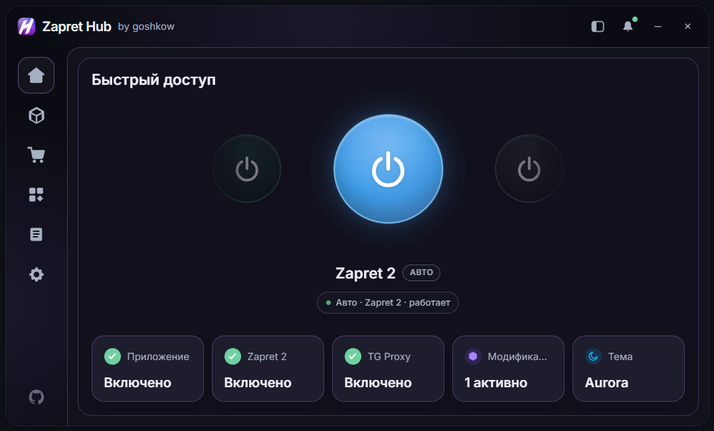
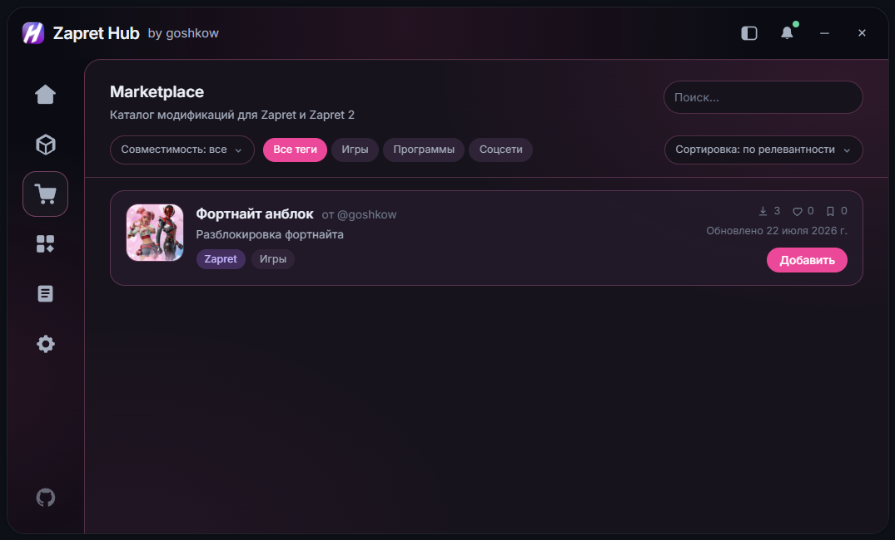

<div align="center">

# Zapret Hub (continuation)

Это форк [Goshkow/Zapret-Hub](https://github.com/goshkow/Zapret-Hub) (MIT) — независимое продолжение после закрытия оригинального проекта. VPN и Marketplace удалены; проект предоставляет обход DPI через [bol-van/zapret2](https://github.com/bol-van/zapret2).

<p align="center">
  <picture>
    <source media="(prefers-color-scheme: dark)" srcset="assets/banner-dark.png">
    <source media="(prefers-color-scheme: light)" srcset="assets/banner-light.png">
    
  </picture>
</p>

<a href="https://github.com/klondike0x/zapret-hub-continuation/releases/latest">
  </a>


</div>

**Zapret Hub** — единое Windows-приложение для управления обходом DPI. Вместо ручного поиска скриптов и конфигураций можно выбрать подходящий способ подключения, доверить настройку автоматике и управлять всем из одного окна. В приложении доступны **Zapret**, **Zapret 2** и вспомогательные компоненты.

## 💡 Что это такое

Zapret Hub подходит и опытным пользователям, и тем, кому нужен понятный интерфейс для настройки соединения без ручного редактирования скриптов и конфигураций.

Приложение:

- ✅ объединяет Zapret и Zapret 2 в одном интерфейсе;
- ✅ помогает выбрать подходящий вариант при первом запуске;
- ✅ автоматически проверяет конфигурации и запоминает рабочую;
- ✅ позволяет в любой момент переключить способ подключения в **Быстром доступе**;
- ✅ работает в трее, показывает понятные статусы и хранит настройки локально;
- ✅ не использует рекламную аналитику.

> [!NOTE]
> Выбор при первом запуске определяет только то, какой способ будет настроен первым. Позже между режимами можно свободно переключаться.

## 🧭 Первый запуск

Онбординг проводит пользователя через настройку без необходимости редактировать bat-файлы или разбираться во внутреннем устройстве компонентов.

1. **Выберите основной сетевой компонент.** Доступны Zapret, Zapret 2 и вариант «Без основного компонента».
2. **Ответьте на несколько вопросов.** Набор шагов зависит от выбранного способа.
3. **Дождитесь проверки.** Для Zapret и Zapret 2 оркестратор переберёт конфигурации и выберет рабочую.
4. **Запустите приложение.** Готовый режим появится на странице быстрого доступа.

### Если выбран Zapret

Можно отметить нужные сайты и приложения вручную или оставить автоматическую настройку. Программа подготовит правила для выбранных сервисов, проверит доступные `general`-конфигурации и сохранит лучший результат.

### Если выбран Zapret 2

Оркестратор проверит стратегии Zapret 2 и подготовит рабочую конфигурацию автоматически. При необходимости параметры и дополнения можно изменить позже.

### Если выбран режим «Без основного компонента»

Zapret и Zapret 2 запускаться не будут. При этом можно отдельно использовать DNS.

## 🔀 Способы подключения

| Способ | Для чего нужен | Как настраивается |
|--------|----------------|-------------------|
| 🛡️ **Zapret** | Локальная обработка сетевого трафика без передачи соединения через сторонние серверы | Выбор сервисов, модификаций и `general`; ручная настройка или оркестратор |
| 🔷 **Zapret 2** | Новое поколение Zapret на `winws2` с Lua-стратегиями | Автоматический анализ стратегий или ручная настройка |
| 🌐 **DNS** | Замена системных DNS-серверов | DHCP, Xbox DNS, Cloudflare, AdGuard, Google или Яндекс |
| ⚪ **Без основного компонента** | Работа без Zapret и Zapret 2 | Можно оставить только вспомогательные компоненты |

> Запуск одного режима не ограничивает доступ к остальным. Активный способ можно быстро изменить на главной странице или через меню в трее.

## 🧠 Автоматическая настройка

Встроенный оркестратор избавляет от бесконечного ручного перебора конфигураций.

Для **Zapret** он учитывает выбранные сервисы, последовательно проверяет `general`-конфигурации и сохраняет рабочий вариант. Для **Zapret 2** он анализирует доступные стратегии и применяет подходящую. Результат остаётся доступен для ручной корректировки: автоматика помогает начать работу, но не забирает контроль у пользователя.

## ✨ Возможности

| Функция | Описание |
|---------|----------|
| 🎮 **Единая кнопка** | Включение и отключение выбранного способа подключения одним нажатием |
| 🔁 **Быстрое переключение** | Смена Zapret, Zapret 2 и режима без основного компонента без поиска настроек |
| 🧠 **Оркестратор** | Автоматический подбор рабочих конфигураций для Zapret и Zapret 2 |
| 🧭 **Сервисы** | Настройка под конкретные сайты, игры, приложения, CDN и лаунчеры |
| 🌐 **DNS** | Быстрый выбор системного DNS-провайдера или возврат к DHCP |
| 📦 **Модификации** | Импорт из ZIP, папки, GitHub или отдельных файлов |
| 📁 **Файлы** | Редактирование пользовательских списков и конфигураций Zapret |
| 📋 **Логи** | Раздельные журналы компонентов с переходом к последним событиям |
| 🔔 **Уведомления** | Сообщения внутри приложения и уведомления Windows |
| 🔊 **Звуки** | Звуковое сопровождение действий и состояний с возможностью отключения |
| 🎨 **Интерфейс** | Темы Aurora, Obsidian и Concrete, русский и английский языки |
| 🔷 **Трей** | Управление состоянием и способом подключения без открытия окна |
| 🚀 **Автозапуск** | Запуск программы и выбранных компонентов вместе с Windows |
| 💫 **Обновления** | Обновление приложения и компонентов |
| 📱 **Архитектуры** | Отдельные portable-сборки для Windows x64 и ARM64 |

## 🎀 Компоненты

Раздел **Компоненты** показывает состояние каждого встроенного инструмента и открывает его настройки.

В нём можно обновить Zapret и Zapret 2, повторно запустить настройку Zapret и выбрать DNS-провайдера. Основной способ подключения переключается через быстрый доступ, а вспомогательные компоненты управляются отдельно.

## 🌐 DNS

Компонент DNS меняет системные DNS-серверы без ручного открытия настроек Windows. Доступны системный DHCP, Xbox DNS, Cloudflare, AdGuard, Google и Яндекс. Приложение показывает конкретные адреса перед выбором и позволяет в любой момент вернуться к автоматическим настройкам роутера или провайдера.

DNS можно использовать самостоятельно или вместе с Zapret и Zapret 2.

## 🛠️ Модификации

- 🔹 базовые файлы и пользовательские дополнения хранятся отдельно;
- 🔹 несколько включённых модификаций собираются в единый runtime;
- 🔹 поддерживаются ZIP, папки, GitHub и отдельные файлы;
- 🔹 модификации можно создавать и редактировать внутри приложения;
- 🔹 при изменениях merged runtime пересобирается автоматически.

<picture>
  <source media="(prefers-color-scheme: dark)" srcset="assets/mods-dark.png">
  <source media="(prefers-color-scheme: light)" srcset="assets/mods-light.png">
  
</picture>

## 📁 Файлы

Встроенный редактор позволяет работать с пользовательскими доменами, IP-адресами, исключениями, `hosts` и другими конфигурационными файлами Zapret. Раздел предназначен для продвинутой настройки; для обычного запуска редактировать файлы вручную не требуется.

## 📦 Установка

В релизе публикуются:

- `zapret_hub_<версия>_portable_win_x64.zip` — portable для большинства компьютеров Windows;
- `zapret_hub_<версия>_portable_win_arm64.zip` — portable для Windows on ARM;
- `install_zaprethub_<версия>.exe` — slim-установщик, который определяет архитектуру и загружает подходящую сборку;
- `winget-manifests-<версия>.zip` — манифесты автоматической установки через WinGet.

Для обычной установки скачайте `install_zaprethub_<версия>.exe` из [последнего релиза](https://github.com/klondike0x/zapret-hub-continuation/releases/latest). Portable-версию достаточно распаковать в отдельную папку.

## 💻 Требования

- Windows 10 или Windows 11;
- права администратора для управления сетевыми компонентами;
- подключение к интернету для slim-установщика и обновлений.

## 🔗 Используемые проекты

| Инструмент | Автор |
|------------|-------|
| [zapret-discord-youtube](https://github.com/Flowseal/zapret-discord-youtube) | **Flowseal** |
| [zapret2](https://github.com/bol-van/zapret2) | **bol-van** |
| [zapret](https://github.com/bol-van/zapret) | **bol-van** |

> [!CAUTION]
> **Zapret Hub** — интерфейс и менеджер поверх перечисленных инструментов. Приложение не присваивает авторство встроенных проектов; сведения об авторах и исходниках доступны в самом приложении.

## ⚖️ Условия использования

Устанавливая или используя Zapret Hub, пользователь принимает [пользовательское соглашение](docs/legal/ZAPRET_HUB_TERMS_RU.txt). Программа предназначена для законного управления сетевыми подключениями, DNS и совместимыми компонентами; пользователь самостоятельно проверяет допустимость выбранной конфигурации.

# ↪️ Для разработчиков

> [!IMPORTANT]
> При разработке проектов на основе Zapret Hub указывайте автора приложения и авторов используемых инструментов в соответствии с их лицензиями.

## 📁 Структура проекта

Основные каталоги:

- `src/zapret_hub` — прикладная логика, Web UI bridge и сервисы;
- `web_ui` — интерфейс на React, TypeScript и CSS;
- `installer` — slim-установщик и деинсталлятор;
- `packaging` — конфигурация сборки;
- `runtime` — встроенные runtime-файлы компонентов;
- `sample_data` — стартовые данные;
- `ui_assets` — иконки и ресурсы интерфейса.

Рабочие данные создаются отдельно в каталогах `data`, `logs`, `cache`, `mods`, `merged_runtime` и `backups`.

## 🧪 Запуск в разработке

```powershell
python -m venv .venv
.venv\Scripts\Activate.ps1
pip install -e .[dev]
cd web_ui
npm install
npm run build
cd ..
python -m zapret_hub.main
```

## 🔨 Сборка

### Приложение

```powershell
.\scripts\build_nuitka.ps1 -Python .venv\Scripts\python.exe -OutputDir dist_nuitka
```

### Slim-установщик

```powershell
.\scripts\build_nuitka_installer.ps1 -Python .venv\Scripts\python.exe -OutputDir dist_installer -SkipUninstaller
```

# Не работает

> [!WARNING]
> ### Антивирус сообщает об угрозе
>
> В Zapret и Zapret 2 используется WinDivert - драйвер для перехвата и фильтрации трафика. Без него локальная обработка трафика в Windows работать не может. Некоторые антивирусы относят такие инструменты к PUA/RiskTool или эвристически блокируют неподписанные сборки.
>
> Загружайте приложение только из раздела Releases. Если антивирус удалил WinDivert, восстановите файл из карантина и добавьте папку Zapret Hub в исключения. Не отключайте защиту целиком, если не понимаете последствия.

> [!IMPORTANT]
> ### Не открывается нужный сервис
>
> 1. Откройте настройки Zapret или Zapret 2 и повторно запустите автоматический подбор.
> 2. Проверьте, что нужный сайт или приложение отмечены в выборе сервисов.
> 3. Попробуйте другой способ подключения через быстрый доступ.
> 4. Проверьте уведомления и логи приложения: там будет указана причина ошибки запуска.
> 5. Обновите приложение и компоненты.
> 6. Если проблема сохраняется, создайте [issue](https://github.com/klondike0x/zapret-hub-continuation/issues).
